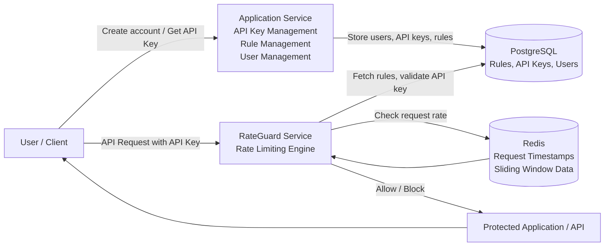

# 🚦 RateGuard — Distributed Rate Limiter as a Service

> A high-performance, distributed rate limiting service built with Spring Boot and Redis using a Sliding Window algorithm to protect APIs from abuse, overload, and malicious traffic.


---

## 📖 Overview

**RateGuard** is a centralized, distributed rate limiting service designed to protect APIs and microservices from excessive traffic, abuse, and malicious attacks.

Unlike traditional in-memory rate limiters that fail in distributed environments, RateGuard uses **Redis as a shared distributed store** and implements a **Sliding Window algorithm** for accurate and reliable rate limiting across multiple servers.

It can be deployed as a standalone service and integrated with any application via HTTP.

---

## ❗ Problem It Solves

Modern distributed systems expose APIs such as:

- Authentication APIs
- Payment APIs
- Public APIs
- Microservices endpoints

These APIs are vulnerable to:

- Brute-force attacks
- Bot traffic
- API abuse
- Distributed Denial of Service (DDoS)
- Traffic spikes causing system overload

Traditional in-memory rate limiters fail in distributed systems because each server maintains its own request counters.

RateGuard solves this by using a **centralized distributed Redis store**.

---

## ✨ Key Features

- Distributed rate limiting using Redis
- Sliding Window algorithm for precise request control
- Centralized Rate Limiter as a Service (RLaaS)
- High-performance and low latency
- Fail-open strategy for high availability
- Easy integration via HTTP API
- Scalable and cloud-ready architecture
- Supports per-user, per-IP, or per-API-key limits

---

## 🏗️ System Architecture



## Architecture Overview

The system is divided into two logical planes:

### Control Plane — Application Service
Handles configuration and management:
- User registration
- API key generation
- Rate limit rule creation
- Rule management

### Data Plane — RateGuard Service
Handles high-speed request validation:
- Validates API keys
- Fetches rules from PostgreSQL
- Tracks requests in Redis
- Applies rate limiting logic


---

## ⚙️ How Rate Limiting Works (Sliding Window Algorithm)

RateGuard uses Redis Sorted Sets to implement Sliding Window rate limiting:

For each request:

1. Remove timestamps outside time window
2. Count valid requests within window
3. Compare count with configured limit
4. Allow or block request accordingly
5. Store current timestamp if allowed

### Advantages

- More accurate than Fixed Window
- Prevents burst traffic at window boundaries
- Smooth and fair request handling

---

## 🛡️ High Availability — Fail-Open Strategy

If Redis becomes unavailable:

- Requests are allowed instead of blocked
- Prevents service outages
- Ensures system availability

This is critical for production systems where availability is more important than strict enforcement.

---

## 🔌 API Integration

Applications can integrate RateGuard via HTTP API.

### Endpoint

```

POST /check-limit

````

### Request Body

```json
{
  "identifier": "user123",
  "endpoint": "/login",
  "method": "POST"
}
````

### Response

**Allowed**

```

200 OK

```

**Blocked**

```

429 Too Many Requests

```

---

## 📊 Monitoring and Analytics (Planned / Extendable)

Supports integration with monitoring tools such as Prometheus and Grafana to track:

* Allowed vs blocked requests
* Traffic patterns
* Top offending users or IPs
* API usage statistics

---

## 🧱 Tech Stack

| Component         | Technology          |
| ----------------- | ------------------- |
| Backend           | Spring Boot         |
| Language          | Java 17             |
| Distributed Store | Redis               |
| Database          | PostgreSQL          |
| Build Tool        | Maven               |
| Monitoring        | Prometheus, Grafana |


---

## 🚀 Installation and Setup

### Prerequisites

* Java 17
* Redis
* PostgreSQL
* Maven

---

### Step 1: Clone Repository

```bash
git clone https://github.com/vasan12sp/rate-limiter.git
cd rate-limiter
```

---

### Step 2: Start Redis

```bash
redis-server
```

---

### Step 3: Run Application

```bash
mvn clean install
mvn spring-boot:run
```

Application starts on:

```
http://localhost:8080
```

---

## 📈 Use Cases

RateGuard can be used in:

* API Gateways
* Microservices architectures
* SaaS platforms
* Public API providers
* Authentication systems
* Payment services
* Cloud-native applications

---

## 🔮 Future Enhancements

* Kubernetes deployment support
* Multi-region Redis clustering
* Token Bucket algorithm support
* Dynamic rate limit configuration
* Admin dashboard
* AI-based anomaly detection

---

## 👨‍💻 Author

**Vasan S P**

GitHub: [https://github.com/vasan12sp](https://github.com/vasan12sp)

---

## 📄 License

This project is licensed under the MIT License.


